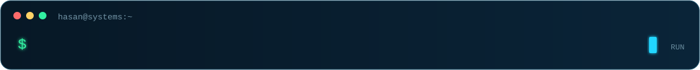
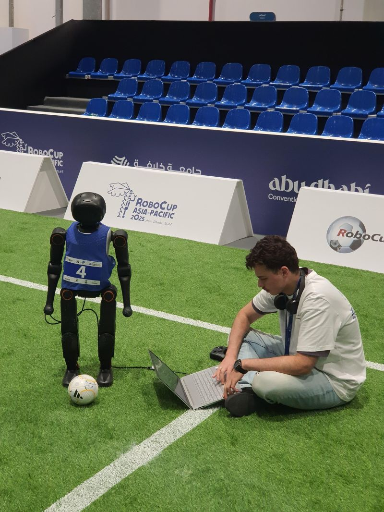
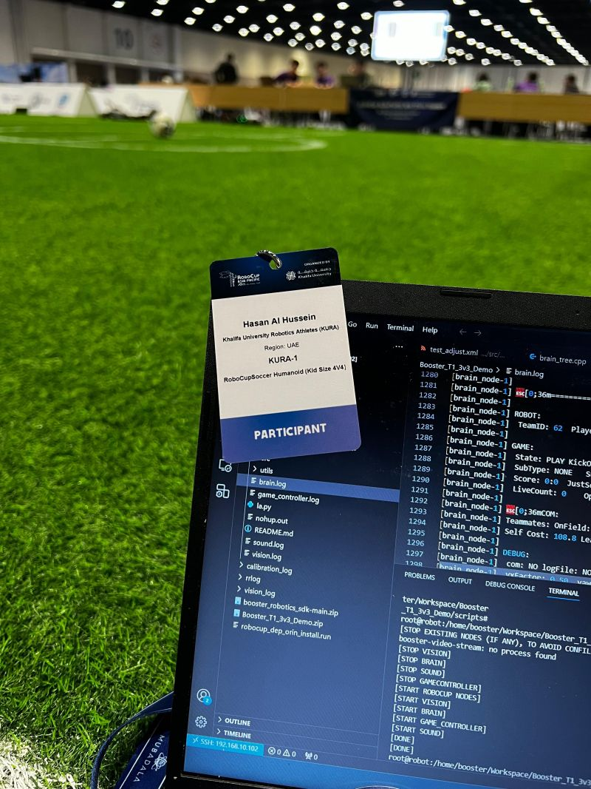
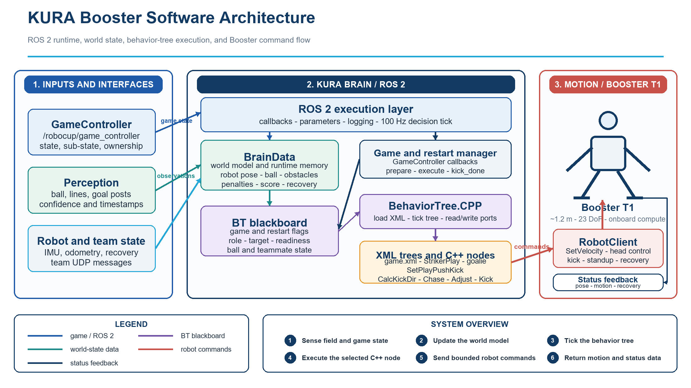

 

 

## Hello, I build the whole system

I am a **Computer Engineering student at Khalifa University** working where software meets the physical world: humanoid robotics, embedded AI, computer vision, networking, and real-time systems.

My favorite engineering problems cannot be solved by a model or a code file alone. The sensor has to be trusted, the decision layer has to be explainable, the motion or interface has to respond correctly, and the result has to survive real testing.

> **My engineering loop:** observe the real system → isolate the failure → implement the smallest reliable change → verify it with evidence.

## The systems I build

<table>
<tr>
<td width="33%" valign="top">

### 01 / Sense

Computer vision, robot world models, physiological sensing, network traces, and embedded inputs.

`OpenCV` `SCRFD` `ArcFace` `IMU` `Wireshark`

</td>
<td width="33%" valign="top">

### 02 / Decide

Behavior trees, role logic, AI-assisted ranking, state machines, and uncertainty analysis.

`BehaviorTree.CPP` `PyTorch` `TinyML` `Algorithms`

</td>
<td width="33%" valign="top">

### 03 / Act

Humanoid motion commands, onboard inference, microcontroller control, and deployed workflows.

`ROS 2` `C/C++` `Jetson` `Arduino` `Next.js`

</td>
</tr>
</table>

## Featured engineering systems

<table>
<tr>
<td width="50%" valign="top">

### 🤖 KURA / Booster T1 Robotics Internship

Eight weeks of humanoid football software work covering restart behaviors, goalkeeper analysis, striker final-touch reliability, hardware testing, and technical leadership.

**Evidence:** 26-page final report · 6 technical diagrams · field photos · participation certificate

`ROS 2` `C++` `BehaviorTree.CPP` `RoboCup`

</td>
<td width="50%" valign="top">

### 🚁 Autonomous UAV Face Recognition

Onboard face detection and recognition on an NVIDIA Jetson Orin Nano, integrating camera input, tracking, privacy controls, and live visualization without cloud inference.

**Evidence:** system report · architecture diagrams · demo videos · hardware demonstrations

`Jetson` `CUDA` `TensorRT` `OpenCV` `Python`

</td>
</tr>
<tr>
<td width="50%" valign="top">

### 🧠 Embedded Focus Monitor

A TinyML system that fuses pulse and motion signals on an Arduino Nano 33 BLE Sense and streams live focus-state estimates to a browser dashboard.

**Evidence:** firmware · dashboard · confusion matrix · feature and sensor visualizations

`Arduino` `C++` `Edge Impulse` `BLE` `TinyML`

</td>
<td width="50%" valign="top">

### 🌐 TCP Multimedia Streaming

A multithreaded C client/server system for live audio and video across routed subnets, validated at the transport and network layers with Wireshark.

**Evidence:** C source · routed topology · packet capture validation · technical report

`C` `TCP/IP` `Threads` `SDL` `FFmpeg`

</td>
</tr>
</table>

## Robotics in the field

<table>
<tr>
<td width="50%"></td>
<td width="50%"></td>
</tr>
<tr>
<td><b>Sideline calibration:</b> adjusting the humanoid robot with a development laptop beside the competition field.</td>
<td><b>Terminal diagnostics:</b> inspecting live robot logs during field testing at RoboCup Asia-Pacific 2025.</td>
</tr>
</table>

<b>Open the KURA software architecture</b>

 

## Engineering record

| Period | Milestone | Engineering focus |
| --- | --- | --- |
| 2025 | **KURA at RoboCup Asia-Pacific, Abu Dhabi** | C++ adjust/crabwalk behavior and set-piece positioning under competition constraints |
| May 2026 | **RoboCup Asia-Pacific Tianjin Invitational** | Humanoid Soccer League participation with KURA |
| Jun–Jul 2026 | **KUCARS / KURA Robotics Internship** | ROS 2, BehaviorTree.CPP, restart strategy, goalkeeper/striker analysis, testing, and handover |
| Ongoing | **Computer Engineering at Khalifa University** | Intelligent systems that connect perception, decisions, hardware, and deployment |

## Technical toolbox

**Robotics and embedded:** ROS 2, BehaviorTree.CPP, Booster T1, Jetson Orin Nano, Arduino Nano 33 BLE Sense, FRDM-KL25Z, UART, GPIO, IMU sensing 
**AI and vision:** OpenCV, PyTorch, TensorFlow, CUDA, TensorRT, SCRFD, ArcFace, Edge Impulse 
**Systems and networking:** Linux, sockets, TCP/IP, multithreading, Wireshark, FFmpeg, SDL 
**Product engineering:** Next.js, TypeScript, Supabase, SQL, Vercel, Git

## Complete project index

| Domain | Repository | What is public |
| --- | --- | --- |
| Humanoid robotics | [KURA Booster Robotics Internship](https://github.com/Hasan-Al-Hussein/kura-booster-robotics-internship) | Final report, diagrams, field evidence, certificate |
| Humanoid robotics | [KURA RoboCup 2025](https://github.com/Hasan-Al-Hussein/kura-robocup-2025) | Competition story, photos, safe C++ snippets |
| Embedded AI | [UAV Face Recognition](https://github.com/Hasan-Al-Hussein/uav-face-recognition-system) | Technical report, architecture, demos, photos |
| TinyML | [Embedded Focus Monitor](https://github.com/Hasan-Al-Hussein/embedded-focus-monitor) | Firmware, dashboard, evaluation visuals |
| Systems | [TCP Multimedia Streaming](https://github.com/Hasan-Al-Hussein/tcp-multimedia-streaming) | C client/server, network evidence, report |
| Embedded C | [Microcontroller ATM](https://github.com/Hasan-Al-Hussein/microcontroller-atm-system) | C implementation, hardware diagrams, report |
| Bioinformatics AI | [DxVar](https://github.com/Hasan-Al-Hussein/dxvar-ai-genomic-variant-analysis) | Research report, presentation, result visuals |
| Quantitative research | [Quantum Randomness Analysis](https://github.com/Hasan-Al-Hussein/quantum-randomness-analysis) | Mathematical report and analysis visuals |
| Defensive security | [Android Work-Profile Research](https://github.com/Hasan-Al-Hussein/android-workprofile-exploit) | Lab automation, report, defensive findings |
| Full-stack product | [Employee Request Hub](https://github.com/Hasan-Al-Hussein/employee-request-hub) | Next.js/Supabase source, schema, live deployment |

## Let’s build something that works outside the demo

I am interested in robotics, embedded intelligence, autonomous systems, and engineering work where careful software has a visible physical or operational result.

Abu Dhabi, United Arab Emirates · Computer Engineering · Intelligent physical systems

