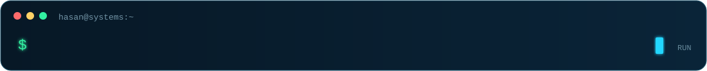
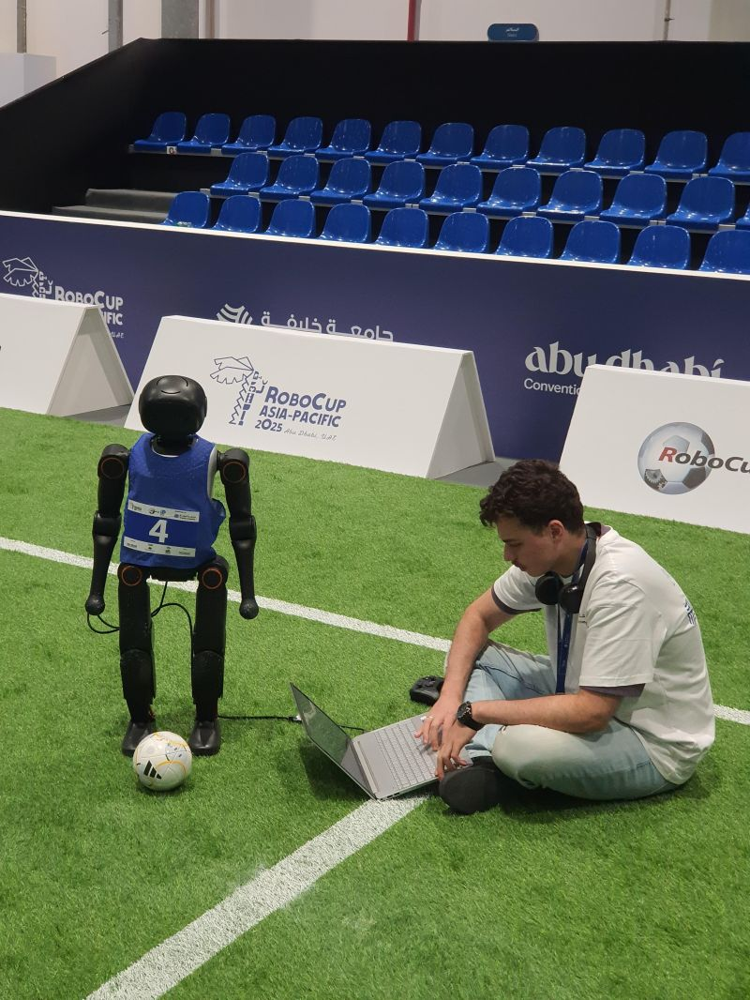
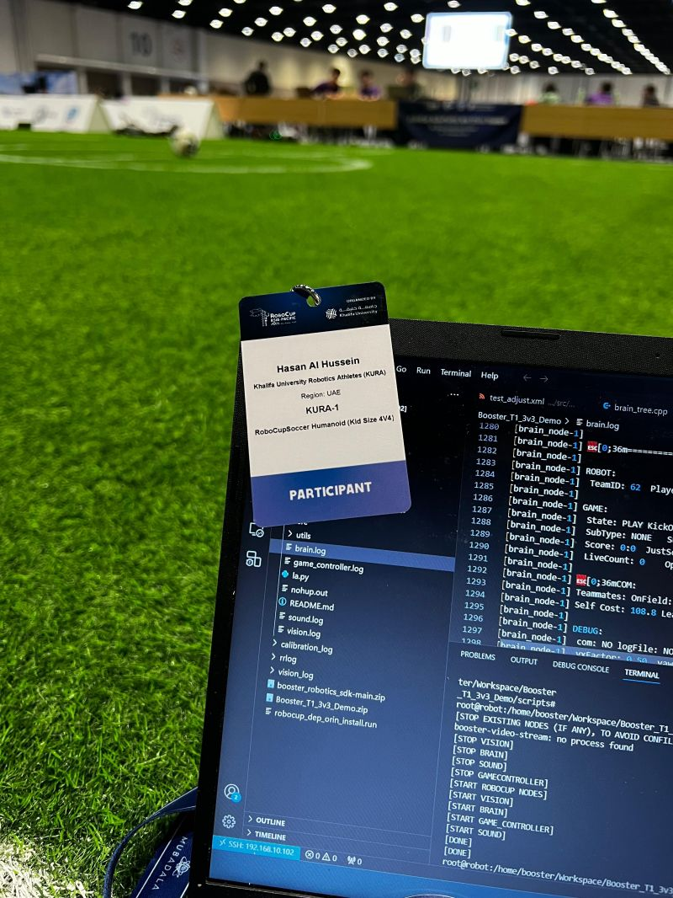
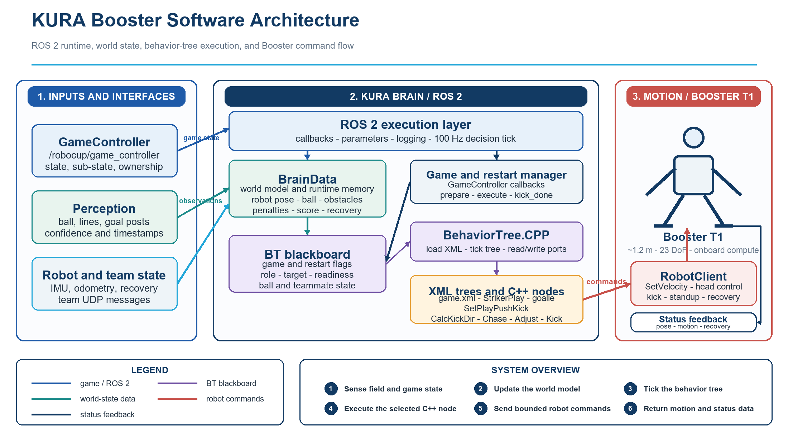

 

 

## Engineering trustworthy software and intelligent systems

I am a **Computer Engineering graduate from Khalifa University** building local AI, full-stack products, humanoid robotics, embedded intelligence, computer vision, networking, and real-time systems.

My favorite engineering problems cross boundaries: retrieved evidence must be traceable, privileged actions must be reviewable, sensors must be trusted, interfaces must respond clearly, and the result must survive measurable testing.

> **My engineering loop:** understand the system → define the trust boundary → build the smallest reliable change → verify it with evidence.

## The systems I build

<table>
<tr>
<td width="33%" valign="top">

### 01 / Sense

Document evidence, computer vision, robot world models, physiological sensing, network traces, and embedded inputs.

`pgvector` `PostgreSQL FTS` `OpenCV` `IMU` `Wireshark`

</td>
<td width="33%" valign="top">

### 02 / Decide

Evidence gates, behavior trees, role logic, human approval, state machines, and uncertainty analysis.

`LangGraph` `BehaviorTree.CPP` `PyTorch` `TinyML`

</td>
<td width="33%" valign="top">

### 03 / Act

Audited task workflows, humanoid motion commands, onboard inference, microcontroller control, and deployed products.

`FastAPI` `Next.js` `ROS 2` `Jetson` `Arduino`

</td>
</tr>
</table>

## Featured engineering systems

<table>
<tr>
<td valign="top">

### 🛡️ LocalGuard AI — Evidence before action

A CPU-only document intelligence system for PDF, DOCX, and TXT files. It combines pgvector and PostgreSQL full-text retrieval, resolves citations to immutable source offsets, and keeps every AI-proposed task behind authenticated LangGraph review.

**Verified evidence:** 25/25 pinned-Ollama cases · 1.0000 citation precision · 7/7 approval transitions · 384 Python tests · 45 integration tests · 46 frontend tests · five passing CI jobs

`FastAPI` `Next.js` `PostgreSQL` `pgvector` `LangGraph` `Ollama` `Docker`

</td>
</tr>
</table>

<table>
<tr>
<td width="50%" valign="top">

### 🤖 KURA / Booster T1 Robotics Internship

Eight weeks of humanoid football software work covering restart behaviors, goalkeeper analysis, striker final-touch reliability, hardware testing, and technical leadership.

**Evidence:** 26-page final report · 6 technical diagrams · field photos · participation certificate

`ROS 2` `C++` `BehaviorTree.CPP` `RoboCup`

</td>
<td width="50%" valign="top">

### 📲 Referral Attribution Lab

Production-shaped mobile attribution that survives direct links, deferred installs, restarts, retries, and interrupted signup without changing the accepted referral identity.

**Evidence:** 174 Jest tests · 90.4% statement coverage · strict TypeScript · Android CI compile

`React Native` `Expo` `TypeScript` `Branch` `Firebase`

</td>
</tr>
<tr>
<td width="50%" valign="top">

### 🚁 Autonomous UAV Face Recognition

Onboard face detection and recognition on an NVIDIA Jetson Orin Nano, integrating camera input, tracking, privacy controls, and live visualization without cloud inference.

**Evidence:** system report · architecture diagrams · demo videos · hardware demonstrations

`Jetson` `CUDA` `TensorRT` `OpenCV` `Python`

</td>
<td width="50%" valign="top">

### 🧠 Embedded Focus Monitor

A TinyML system that fuses pulse and motion signals on an Arduino Nano 33 BLE Sense and streams live focus-state estimates to a browser dashboard.

**Evidence:** firmware · dashboard · confusion matrix · feature and sensor visualizations

`Arduino` `C++` `Edge Impulse` `BLE` `TinyML`

</td>
</tr>
<tr>
<td width="50%" valign="top">

### Employee Request Hub

A deployed internal request product with authenticated employee and approver workflows, role-aware views, PostgreSQL Row Level Security, and a complete request-to-decision lifecycle.

**Evidence:** Next.js source · database schema · product architecture · live deployment

`Next.js` `TypeScript` `Supabase` `PostgreSQL` `Vercel`

</td>
<td width="50%" valign="top">

### Proficien AI Automation Internship

An end-to-end client engagement system spanning responsive web delivery, lead ingestion, n8n orchestration, HTML email, response routing, HubSpot CRM, and reliability testing.

**Evidence:** animated systems banner · 3 architecture diagrams · real workflow screenshots · technical case study

`n8n` `HubSpot` `APIs` `Webhooks` `HTML/CSS`

</td>
</tr>
</table>

## Robotics in the field

<table>
<tr>
<td width="50%"></td>
<td width="50%"></td>
</tr>
<tr>
<td><b>Sideline calibration:</b> adjusting the humanoid robot with a development laptop beside the competition field.</td>
<td><b>Terminal diagnostics:</b> inspecting live robot logs during field testing at RoboCup Asia-Pacific 2025.</td>
</tr>
</table>

<b>Open the KURA software architecture</b>

 

## Engineering record

| Period | Milestone | Engineering focus |
| --- | --- | --- |
| Jun-Jul 2025 | **Proficien Internship** | Responsive web delivery, n8n orchestration, HTML email, HubSpot CRM, debugging, and technical handover |
| 2025 | **KURA at RoboCup Asia-Pacific, Abu Dhabi** | C++ adjust/crabwalk behavior and set-piece positioning under competition constraints |
| May 2026 | **RoboCup Asia-Pacific Tianjin Invitational** | Humanoid Soccer League participation with KURA |
| Jun–Jul 2026 | **KUCARS / KURA Robotics Internship** | ROS 2, BehaviorTree.CPP, restart strategy, goalkeeper/striker analysis, testing, and handover |
| 2026 | **BSc in Computer Engineering, Khalifa University** | Intelligent systems that connect perception, decisions, hardware, and deployment |
| Aug 2026 | **LocalGuard AI** | Local-first RAG, immutable citations, human approval, exactly-once execution, and reproducible evaluation |

## Technical toolbox

**Robotics and embedded:** ROS 2, BehaviorTree.CPP, Booster T1, Jetson Orin Nano, Arduino Nano 33 BLE Sense, FRDM-KL25Z, UART, GPIO, IMU sensing 
**AI, retrieval, and vision:** RAG, LangGraph, Ollama, pgvector, OpenCV, PyTorch, TensorFlow, CUDA, TensorRT, SCRFD, ArcFace, Edge Impulse 
**Systems and networking:** Linux, sockets, TCP/IP, multithreading, Wireshark, FFmpeg, SDL 
**Product engineering:** FastAPI, Next.js, React Native, TypeScript, PostgreSQL, Redis, Celery, Supabase, Vercel, Git 
**Automation and integration:** n8n, HubSpot, Apollo, Gmail, Google Sheets, HTTP APIs, webhooks

## Complete project index

| Domain | Repository | What is public |
| --- | --- | --- |
| Local AI / document intelligence | [LocalGuard AI](https://github.com/Hasan-Al-Hussein/localguard-ai) | FastAPI/Next.js source, hybrid RAG, exact citations, approval workflow, demo, evaluation, and passing CI |
| Mobile reliability | [Referral Attribution Lab](https://github.com/Hasan-Al-Hussein/referral-attribution-lab) | React Native/Expo source, durable attribution design, 174 tests, coverage, Android CI, live walkthrough |
| Mobile product / AI | [Everleaf Sustainability App](https://github.com/Hasan-Al-Hussein/everleaf-sustainability-app) | Expo application, protected AI API boundary, screenshots, architecture, and CI |
| Defensive security | [Network Security Detection Lab](https://github.com/Hasan-Al-Hussein/network-security-detection-lab) | Isolated topology, Snort rule, packet evidence, Cowrie correlation, and reproducible lab guide |
| AI automation | [Proficien Automation Internship](https://github.com/Hasan-Al-Hussein/proficien-ai-automation-internship) | Architecture, workflow evidence, reliability model, technical case study |
| Humanoid robotics | [KURA Booster Robotics Internship](https://github.com/Hasan-Al-Hussein/kura-booster-robotics-internship) | Final report, diagrams, field evidence, certificate |
| Humanoid robotics | [KURA RoboCup 2025](https://github.com/Hasan-Al-Hussein/kura-robocup-2025) | Competition story, photos, safe C++ snippets |
| Embedded AI | [UAV Face Recognition](https://github.com/Hasan-Al-Hussein/uav-face-recognition-system) | Technical report, architecture, demos, photos |
| TinyML | [Embedded Focus Monitor](https://github.com/Hasan-Al-Hussein/embedded-focus-monitor) | Firmware, dashboard, evaluation visuals |
| Systems | [TCP Multimedia Streaming](https://github.com/Hasan-Al-Hussein/tcp-multimedia-streaming) | C client/server, network evidence, report |
| Embedded C | [Microcontroller ATM](https://github.com/Hasan-Al-Hussein/microcontroller-atm-system) | C implementation, hardware diagrams, report |
| Bioinformatics AI | [DxVar](https://github.com/Hasan-Al-Hussein/dxvar-ai-genomic-variant-analysis) | Research report, presentation, result visuals |
| Quantitative research | [Quantum Randomness Analysis](https://github.com/Hasan-Al-Hussein/quantum-randomness-analysis) | Mathematical report and analysis visuals |
| Defensive security | [Android Work-Profile Research](https://github.com/Hasan-Al-Hussein/android-workprofile-exploit) | Lab automation, report, defensive findings |
| Full-stack product | [Employee Request Hub](https://github.com/Hasan-Al-Hussein/employee-request-hub) | Next.js/Supabase source, schema, live deployment |

## Let’s build something that holds up outside the demo

I am interested in trustworthy AI, full-stack systems, robotics, embedded intelligence, and engineering work where careful software has a visible operational or physical result.

Abu Dhabi, United Arab Emirates · Software and AI engineering · Intelligent systems

